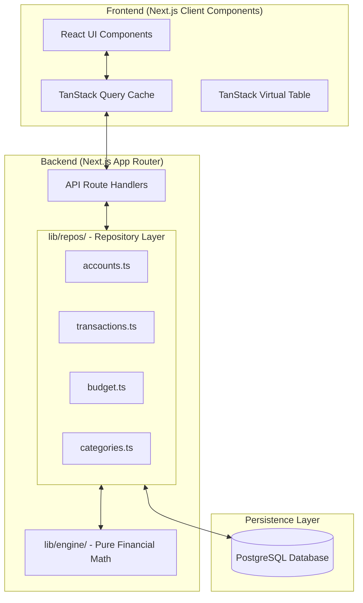
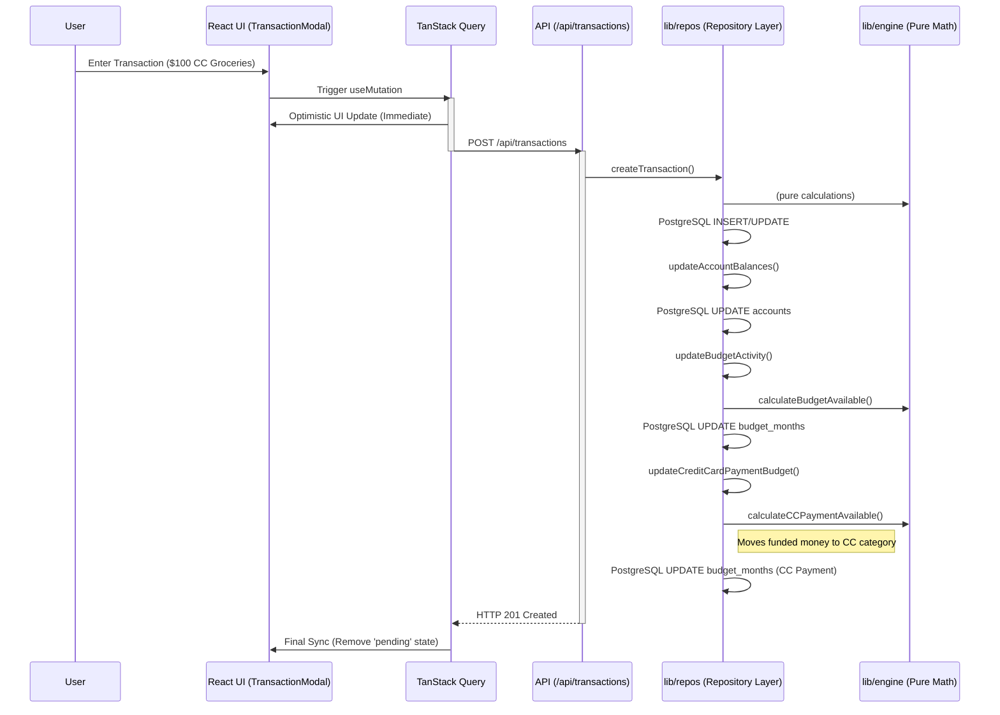

# System Architecture Specification

This document provides a comprehensive technical breakdown of the YNAB Clone architecture, detailings its design patterns, data flow, and technology rationale.

## 🏗 High-Level Topography

The application follows a modern monolithic architecture with a clearly defined separation between the persistent storage layer, the server-side business engine, and the reactive frontend.

## 🛠 Technology Stack Rationale

### Persistent Storage: PostgreSQL & Drizzle ORM

- **Choice**: PostgreSQL was selected for its robustness, scalability, and SaaS-readiness. Drizzle ORM provides type-safe, dialect-agnostic database access.
- **Driver**: `postgres-js` for production, `@electric-sql/pglite` (in-process WASM) for unit tests.

### Framework: Next.js 15 (App Router)

- Leverages **Server Components** for initial data fetching and **Route Handlers** for a robust, type-safe API.
- Implements **Streaming** and **Suspense** to maintain UI responsiveness while complex RTA calculations are processed on the server.

### Reactive Data Layer: TanStack Query (React Query)

- **Optimistic UI**: Every mutation (e.g., assigning money) implements an `onMutate` hook that updates the local cache immediately, providing a latency-free experience.
- **Persistence**: Queries are invalidated intelligently to ensure the budget and account balances are always in sync after a transaction.

## 🔄 Transaction Lifecycle (Sequence Diagram)

The following diagram illustrates the complex chain of events triggered when a user records a new credit card transaction.

## 🚀 Performance & Scalability

### Table Virtualization

The `VirtualTransactionTable` utilizes `@tanstack/react-virtual` to handle datasets of 10,000+ entries.

- **Dynamic Sizing**: Rows are rendered only when they enter the viewport.
- **Overrun**: Extra rows are pre-computed outside the viewport to prevent "flashing" during rapid scrolling.

### Optimistic Concurrency

Since the database is PostgreSQL, write operations leverage Drizzle ORM's `db.transaction()` for batch updates (like reordering categories) to ensure database integrity.

## 🛡 Security & Integrity

- **Foreign Key Constraints**: PostgreSQL's foreign key constraints are strictly enforced to prevent orphaned transactions.
- **Input Sanitization**: All inputs are sanitized through Zod schemas at the API boundary and Drizzle ORM's parameterized queries at the DB layer.
- **Finite Math**: The `updateBudgetAssignment` function implements safety guards for non-finite numbers and extreme value clamping to prevent overflows in the financial logic.

## 🏗 Modular Repository Pattern

The database layer is split into domain-specific **Repositories** (`lib/repos/*.ts`). This enforces "Separation of Concerns" and makes code easier to navigate and review.

`API Route` → `Repository` → `Engine (Pure Math)` → `Repository (Write)`

## 🔄 Type-Safe Validation Layer (Zod)

The application uses **Zod** schema validation at the system boundaries (API Inputs). This guarantees that _no invalid data_ ever enters the Domain or Persistence layers.

- **Schemas**: Located in `lib/schemas/*.ts`.
- **Inference**: TypeScript types are inferred from Zod schemas (`z.infer<typeof Schema>`).
- **Middleware**: API routes parse and validate bodies automatically.

## 📦 Standardized DTOs (Data Transfer Objects)

The API contract uses **DTOs** to decouple the internal database schema from the external API response.

- **Input DTOs**: API inputs use **camelCase** (e.g., `accountId`), which are mapped to snake_case for the database.
- **Output DTOs**: API responses use **camelCase**, transformed from the database rows.

## 💾 Offline Persistence (IndexedDB)

The application implements a **Persistent Query Client** using **IndexedDB** (`idb-keyval`). This creates a true "Local-First" experience where the app works identically online or offline and survives browser restarts.

- **Storage Engine**: `idb-keyval` (tiny IndexedDB wrapper).
- **Persister**: `PersistQueryClientProvider` handles hydration/dehydration.
- **Sync Queue**: Visualized in `SyncStatus` to show pending mutations when offline.
