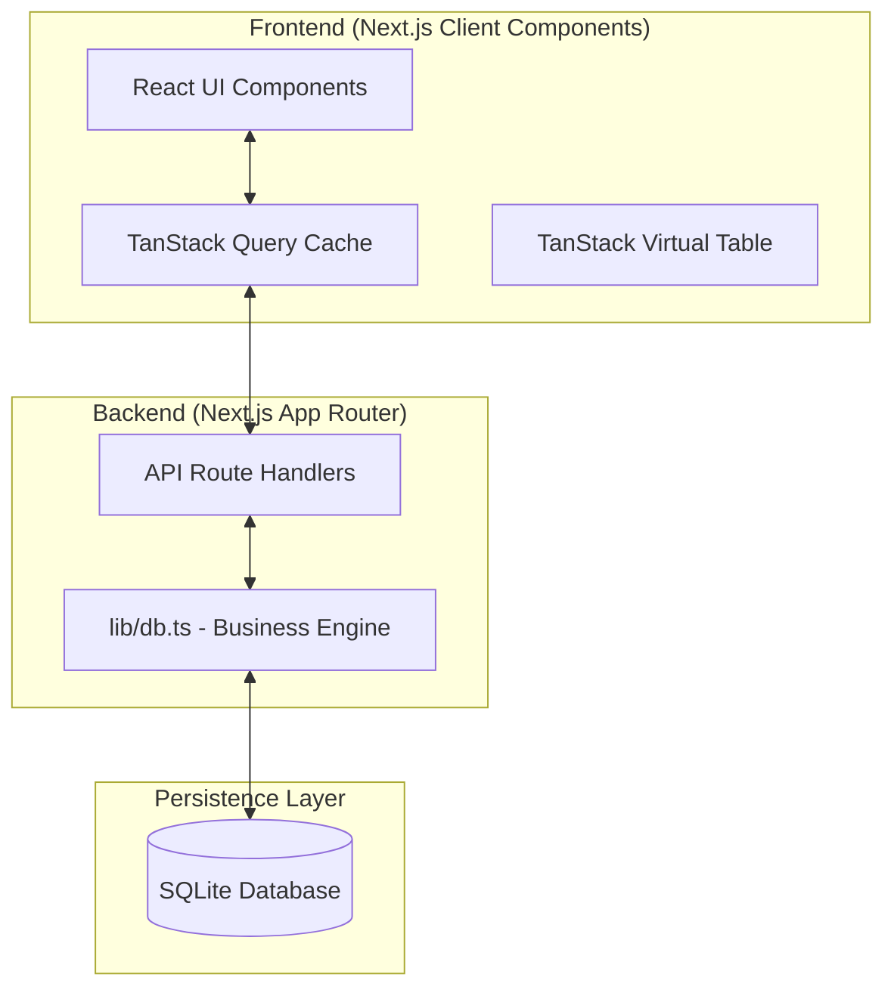
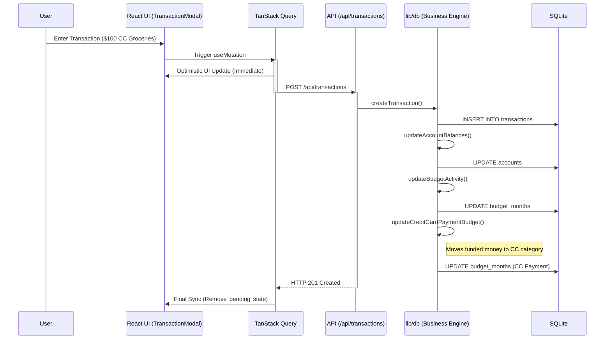

# System Architecture Specification

This document provides a comprehensive technical breakdown of the YNAB Clone architecture, detailings its design patterns, data flow, and technology rationale.

## 🏗 High-Level Topography

The application follows a modern monolithic architecture with a clearly defined separation between the persistent storage layer, the server-side business engine, and the reactive frontend.

## 🛠 Technology Stack Rationale

### Persistent Storage: SQLite & `better-sqlite3`
- **Choice**: SQLite was selected for its zero-configuration simplicity and file-based nature, matching the "Personal Finance" use case where users own their data.
- **Library**: `better-sqlite3` is used instead of asynchronous drivers because it is the fastest SQLite library for Node.js. Its synchronous execution simplifies complex financial transactions that require atomic updates without the overhead of complex async pooling.

### Framework: Next.js 15 (App Router)
- Leverages **Server Components** for initial data fetching and **Route Handlers** for a robust, type-safe API.
- Implements **Streaming** and **Suspense** to maintain UI responsiveness while complex RTA calculations are processed on the server.

### Reactive Data Layer: TanStack Query (React Query)
- **Optimistic UI**: Every mutation (e.g., assigning money) implements an `onMutate` hook that updates the local cache immediately, providing a latency-free experience.
- **Persistence**: Queries are invalidated intelligently to ensure the budget and account balances are always in sync after a transaction.

## 🔄 Transaction Lifecycle (Sequence Diagram)

The following diagram illustrates the complex chain of events triggered when a user records a new credit card transaction.

## 🚀 Performance & Scalability

### Table Virtualization
The `VirtualTransactionTable` utilizes `@tanstack/react-virtual` to handle datasets of 10,000+ entries.
- **Dynamic Sizing**: Rows are rendered only when they enter the viewport.
- **Overrun**: Extra rows are pre-computed outside the viewport to prevent "flashing" during rapid scrolling.

### Optimistic Concurrency
Since the database is a single SQLite file, write operations are gated by the Node.js process. The application utilizes `db.transaction()` for batch updates (like reordering categories) to ensure database integrity and minimize I/O overhead.

## 🛡 Security & Integrity
- **Foreign Key Constraints**: SQLite's `PRAGMA foreign_keys = ON` is strictly enforced to prevent orphaned transactions.
- **Input Sanitization**: All inputs are sanitized through SQLite's prepared statements to eliminate SQL injection risks.
- **Finite Math**: The `updateBudgetAssignment` function implements safety guards for non-finite numbers and extreme value clamping to prevent overflows in the financial logic.
