# Internationalization (i18n) Architecture Assessment

**Date:** 2026-02-13  
**Stack:** Next.js + `next-intl@4.8.2` + `Intl.NumberFormat` + `date-fns`  
**Locales supported:** `es` (default), `en`  
**Overall grade:** B — Solid foundation with enterprise-grade gaps

---

## 1. Architecture Overview

```mermaid
flowchart TD
    A["i18n/request.ts<br/>(getRequestConfig)"] --> B["Cookie: NEXT_LOCALE"]
    B --> C["messages/{locale}.json"]
    C --> D["layout.tsx → NextIntlClientProvider"]
    D --> E["Components: useTranslations()"]

    F["API: /api/user/locale<br/>(PATCH)"] --> G["DB: users.locale"]
    F --> B

    H["useFormatCurrency hook"] --> I["useLocale()"]
    I --> J["Intl.NumberFormat"]

    K["MonthPicker"] --> L["date-fns locale (es/enUS)"]
```



| Layer                   | Mechanism                                   | Status                              |
| ----------------------- | ------------------------------------------- | ----------------------------------- |
| **UI Strings**          | `next-intl` `useTranslations()`             | ✅ 29+ files migrated               |
| **Currency formatting** | `Intl.NumberFormat` via `useFormatCurrency` | ⚠️ Partial - hardcoded defaults     |
| **Date formatting**     | `date-fns` + `toLocaleDateString`           | ⚠️ Duplicated logic, some hardcoded |
| **Number parsing**      | `parseLocaleNumber` (engine)                | ✅ Handles EU/US formats            |
| **Locale detection**    | Cookie → DB (no `Accept-Language`)          | ⚠️ Missing middleware               |
| **Locale persistence**  | API route → cookie + DB column              | ✅ Well-designed                    |
| **CI guards**           | Key parity + hardcoded string scanner       | ✅ Excellent                        |
| **E2E testing**         | 4 locale-switching tests                    | ✅ Good coverage                    |
| **Message structure**   | 14 namespaces, 333 lines, perfect parity    | ✅ Clean                            |

---

## 2. What's Done Well ✅

### 2a. `next-intl` Integration (Enterprise-Grade)

- [request.ts](file:///Users/camilopiedra/Documents/YNAB/ynab-app/i18n/request.ts) properly uses `getRequestConfig` with cookie-based detection
- [layout.tsx](file:///Users/camilopiedra/Documents/YNAB/ynab-app/app/layout.tsx) wraps the entire app in `NextIntlClientProvider` and sets `html lang={locale}` dynamically
- Server components use `getTranslations()` (metadata generation)
- Client components use `useTranslations()` across 29+ files

### 2b. CI Guard Scripts (Best Practice)

- [check-i18n-key-parity.sh](file:///Users/camilopiedra/Documents/YNAB/ynab-app/scripts/check-i18n-key-parity.sh) — ensures `es.json` and `en.json` have identical key structures
- [check-locale-strings.sh](file:///Users/camilopiedra/Documents/YNAB/ynab-app/scripts/check-locale-strings.sh) — scans E2E specs for hardcoded Spanish/English strings (67 patterns checked)
- Both registered in `package.json`: `check:i18n-keys`, `check:locale-strings`

### 2c. E2E Locale Tests

- [i18n-locale.spec.ts](file:///Users/camilopiedra/Documents/YNAB/ynab-app/tests/i18n-locale.spec.ts) covers: default locale display, switching to alternate, switching back, and persistence across page reloads
- [i18n-helpers.ts](file:///Users/camilopiedra/Documents/YNAB/ynab-app/tests/i18n-helpers.ts) provides `t()` and `tLocale()` functions with interpolation support, configurable via `TEST_LOCALE` env

### 2d. Currency Formatting Architecture

- [format.ts](file:///Users/camilopiedra/Documents/YNAB/ynab-app/lib/format.ts) uses `Intl.NumberFormat` with parameterized locale + currency
- [useFormatCurrency.ts](file:///Users/camilopiedra/Documents/YNAB/ynab-app/hooks/useFormatCurrency.ts) reads locale from `next-intl` and currency from budget
- [format-i18n.test.ts](file:///Users/camilopiedra/Documents/YNAB/ynab-app/lib/__tests__/format-i18n.test.ts) covers `es-CO`, `en-US`, `de-DE` with edge cases

### 2e. Number Parsing (Engine Layer)

- [parseLocaleNumber](file:///Users/camilopiedra/Documents/YNAB/ynab-app/lib/engine/assignment.ts#L16-L43) handles European (1.234,56) and US (1,234.56) formats — critical for input fields

### 2f. Message File Quality

- Clean 14-namespace structure: `common`, `auth`, `sidebar`, `budget`, `inspector`, `toolbar`, `moveMoney`, `transactions`, `toasts`, `import`, `budgetList`, `share`, `accounts`, `meta`, `profile`
- ICU-like interpolation used: `{month}`, `{name}`, `{payee}`, `{account}`, `{count}`
- Perfect key parity between `en.json` (333 lines) and `es.json` (333 lines)

---

## 3. Findings — Issues & Gaps

### F1. Hardcoded `es-CO` Locale in Non-Dynamic Contexts 🔴

> [!CAUTION]
> Multiple files bypass the dynamic locale system and use hardcoded `'es-CO'`.

| File                                                                                                                           | Line   | Issue                                                             |
| ------------------------------------------------------------------------------------------------------------------------------ | ------ | ----------------------------------------------------------------- |
| [constants.ts](file:///Users/camilopiedra/Documents/YNAB/ynab-app/lib/constants.ts#L35)                                        | 35     | `DEFAULT_LOCALE = 'es-CO'` used as fallback everywhere            |
| [page.tsx](file:///Users/camilopiedra/Documents/YNAB/ynab-app/app/page.tsx#L57)                                                | 57, 65 | Hardcoded `'es-CO'` for number + date formatting                  |
| [dashboard/page.tsx](<file:///Users/camilopiedra/Documents/YNAB/ynab-app/app/(app)/budgets/[budgetId]/dashboard/page.tsx#L29>) | 29     | Uses `DEFAULT_LOCALE` for date formatting                         |
| [BudgetInspector.tsx](file:///Users/camilopiedra/Documents/YNAB/ynab-app/components/budget/BudgetInspector.tsx#L18)            | 18, 24 | Month names always in `DEFAULT_LOCALE` regardless of user setting |
| [debug-future-months.ts](file:///Users/camilopiedra/Documents/YNAB/ynab-app/scripts/debug-future-months.ts#L8)                 | 8      | Hardcoded `'es-CO'` (script, minor)                               |

**Impact:** Users who switch to English still see Spanish-formatted dates and month names in key screens.

---

### F2. Duplicated Locale-Mapping Logic 🟡

> [!WARNING]
> The ternary `locale === 'en' ? 'en-US' : 'es-CO'` is repeated in 3+ files instead of being centralized.

```typescript
// Appears in:
// - hooks/useFormatCurrency.ts (line 25)
// - components/ProfileModal.tsx (line 93)
// - components/VirtualTransactionTable.tsx (line 17)
const intlLocale = locale === "en" ? "en-US" : "es-CO";
```

**Risk:** When adding a 3rd locale (e.g., `pt`), every occurrence needs manual update. Should be a shared `toIntlLocale(locale)` utility or a mapping table.

---

### F3. No Middleware for Locale Detection 🟡

The app uses cookie-only detection in `i18n/request.ts`. There is **no Next.js middleware** for:

- Parsing `Accept-Language` headers for first-visit auto-detection
- URL prefix routing (e.g., `/en/...`, `/es/...`)
- Redirecting based on user preference

**Impact:** First-time visitors always see Spanish (the hardcoded default), regardless of their browser language.

---

### F4. Hardcoded Aria Labels in MonthPicker 🟡

[MonthPicker.tsx](file:///Users/camilopiedra/Documents/YNAB/ynab-app/components/budget/MonthPicker.tsx) has hardcoded Spanish accessibility strings:

```typescript
// Line 86: aria-label={`Seleccionar mes: ${displayMonth} ${displayYear}`}
// Line 103: aria-label="Año anterior"
// Line 112: aria-label="Año siguiente"
```

These should use `useTranslations()`.

---

### F5. No RTL Support Infrastructure 🔵

No `dir` attribute, no RTL CSS, no bidi considerations. Acceptable for `es` + `en`, but blocks adding Arabic, Hebrew, or Farsi.

---

### F6. Missing `next-intl` TypeScript Integration 🔵

`next-intl` supports type-safe translations via `createTranslator` or a `global.d.ts` declaration:

```typescript
// global.d.ts — enables autocomplete for t('budget.assigned')
type Messages = typeof import("./messages/en.json");
declare interface IntlMessages extends Messages {}
```

Currently not present — means no compile-time checks for typos in `t('budgt.category')`.

---

### F7. No Pluralization Rules 🔵

ICU `{count, plural, one {# item} other {# items}}` syntax is not used anywhere. All plural strings are handled with simple interpolation:

```json
"scheduledTransactions": "Scheduled Transactions ({count})"
```

This won't scale to languages with complex plural rules (e.g., Polish has 4 forms, Arabic has 6).

---

### F8. `html lang` Missing Region Subtag 🔵

[layout.tsx](file:///Users/camilopiedra/Documents/YNAB/ynab-app/app/layout.tsx#L27) sets `lang={locale}` which yields `lang="es"` / `lang="en"`. For currency/number formatting accuracy, `lang="es-CO"` / `lang="en-US"` would be more precise (helps screen readers with regional pronunciation).

---

### F9. Date Formatting Not Centralized 🟡

Date formatting is scattered across 5+ files with different approaches:

| File                          | Approach                                   |
| ----------------------------- | ------------------------------------------ |
| `MonthPicker.tsx`             | `date-fns` with locale                     |
| `ProfileModal.tsx`            | `toLocaleDateString` with ternary          |
| `VirtualTransactionTable.tsx` | `toLocaleDateString` with ternary          |
| `app/page.tsx`                | `toLocaleDateString` hardcoded `es-CO`     |
| `dashboard/page.tsx`          | `toLocaleDateString` with `DEFAULT_LOCALE` |
| `BudgetInspector.tsx`         | `toLocaleDateString` with `DEFAULT_LOCALE` |

Should be a single `useFormatDate()` hook mirroring the `useFormatCurrency()` pattern, or use `next-intl`'s built-in `useFormatter().dateTime()`.

---

## 4. Maturity Assessment

| Dimension                     | Score | Notes                                                                     |
| ----------------------------- | ----- | ------------------------------------------------------------------------- |
| **String externalization**    | 9/10  | Near-complete. Only MonthPicker aria-labels remain                        |
| **Locale switching UX**       | 8/10  | Cookie + DB persistence, but `router.refresh()` causes brief flash        |
| **Currency formatting**       | 7/10  | `Intl.NumberFormat` based, but hardcoded fallback to `es-CO`              |
| **Date formatting**           | 4/10  | Scattered, duplicated, partially hardcoded                                |
| **Number input parsing**      | 9/10  | Engine-layer, handles EU/US                                               |
| **CI/Testing**                | 8/10  | Two CI guards + 4 E2E tests, but no type-safe keys                        |
| **Scalability to 3+ locales** | 5/10  | Duplicated mapping, no middleware, no plurals                             |
| **Accessibility i18n**        | 5/10  | `lang` set, but aria-labels partially hardcoded                           |
| **Server components**         | 7/10  | `getTranslations` used for metadata, some components use `DEFAULT_LOCALE` |

**Overall: B (7.0 / 10)** — Strong foundation for 2-locale apps, needs hardening for enterprise multi-locale.

---

## 5. Prioritized Recommendations

| Priority | Finding                                                           | Effort | Impact                       |
| -------- | ----------------------------------------------------------------- | ------ | ---------------------------- |
| **P1**   | F1 — Remove hardcoded `es-CO` from components, use dynamic locale | S      | High                         |
| **P2**   | F2 — Centralize `toIntlLocale()` mapping utility                  | XS     | Medium                       |
| **P3**   | F9 — Create `useFormatDate()` hook                                | S      | Medium                       |
| **P4**   | F4 — Internationalize MonthPicker aria-labels                     | XS     | Medium                       |
| **P5**   | F6 — Add TypeScript type-safe translations                        | XS     | Medium                       |
| **P6**   | F3 — Add middleware for `Accept-Language` detection               | M      | Medium                       |
| **P7**   | F7 — Add ICU plural support for countable strings                 | S      | Low (2 locales)              |
| **P8**   | F8 — Use region subtag in `html lang`                             | XS     | Low                          |
| **P9**   | F5 — RTL infrastructure                                           | L      | Low (no RTL locales planned) |
