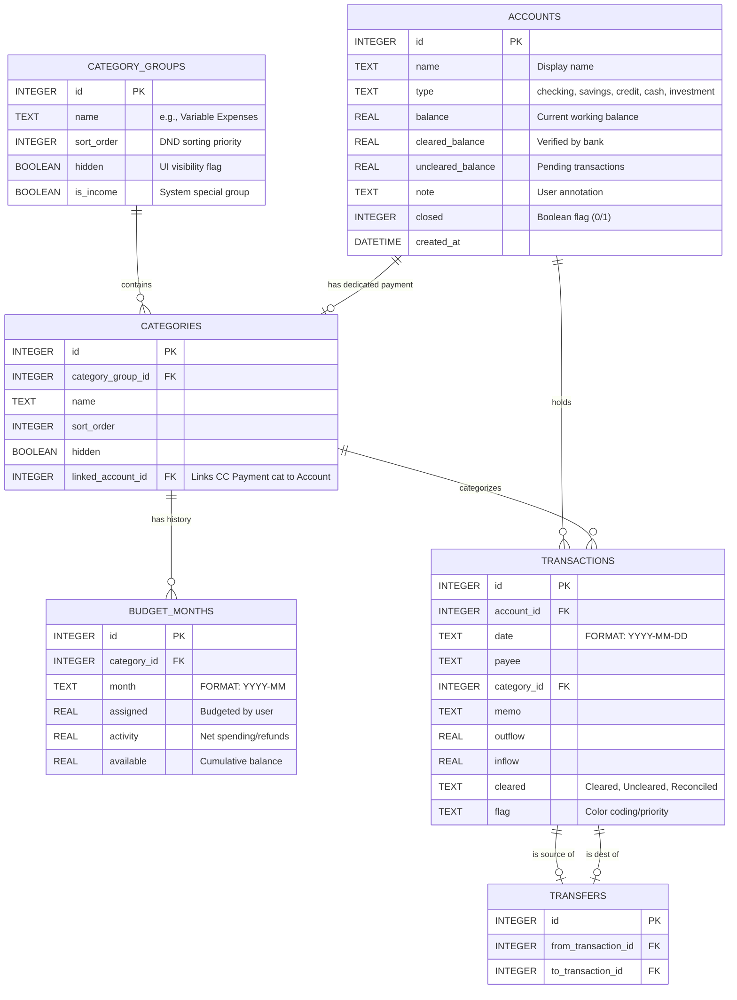

# Data Engineering & Schema Specification

This document provides a deep-dive into the SQLite schema designed for high-performance financial tracking and integrity.

## 🏛 Database Blueprint (ERD)

## 🔍 Schema Optimization

The database includes critical indexes and constraints to ensure sub-millisecond query performance on thousands of rows:

### Performance Indexes
- **`idx_transactions_date`**: Essential for filtering transactions by month and the "Exclusion of Future" rule.
- **`idx_budget_months_month_category`**: Optimizes the RTA and Category Activity lookups which are called millions of times in a busy app.
- **`idx_transactions_account`**: Accelerates individual account views.

### Integrity Constraints
- **Foreign Keys**: Enforced at the driver level (`PRAGMA foreign_keys = ON`). Deleting an account or category leverages `ON DELETE CASCADE` or `SET NULL` accordingly to prevent data corruption.
- **Unique Budget Logic**: `UNIQUE(category_id, month)` prevents duplicate budget entries for the same month/category pair.

## 📈 Field-Level Specification

### The `budget_months` Table (The Engine Room)
This table acts as a time-series record of the budget's state.
- **`assigned`**: The raw amount entered by the user.
- **`activity`**: Calculated dynamically during transaction entry. Inflow - Outflow in a specific month for a specific category.
- **`available`**: **CUMULATIVE**. Unlike other fields, `available` reflects the entire history of that category. When `assigned` changes in Month M, the system propagates the delta to all months M+1, M+2, etc.

### The `cleared` Enum
Used in the `transactions` table to facilitate reconciliation:
1. **Uncleared (White)**: Transaction reported by user but not yet seen on bank statement.
2. **Cleared (Green 'C')**: Transaction verified on bank statement.
3. **Reconciled (Lock icon)**: Transaction locked in a past reconciliation period; cannot be easily edited.

## 💾 Initialization Lifecycle
The database initialization script (`lib/db.ts`) detects a missing file and automatically executes `db/schema.sql`. This ensures a predictable state for new developers or users.
