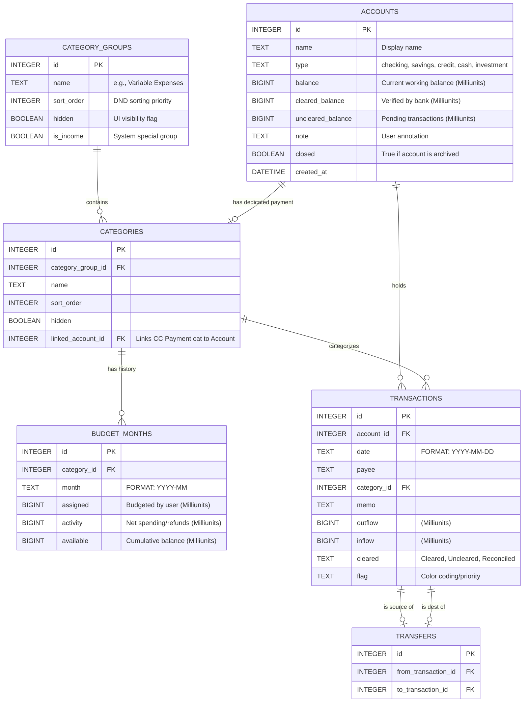

# Data Engineering & Schema Specification

This document provides a deep-dive into the PostgreSQL schema designed for high-performance financial tracking and integrity.

## 🏛 Database Blueprint (ERD)

## 🔍 Schema Optimization

The database includes critical indexes and constraints to ensure sub-millisecond query performance on thousands of rows:

### Performance Indexes

- **`idx_transactions_date`**: Essential for filtering transactions by month and the "Exclusion of Future" rule.
- **`idx_budget_months_month_category`**: Optimizes the RTA and Category Activity lookups which are called millions of times in a busy app.
- **`idx_transactions_account`**: Accelerates individual account views.

### Integrity Constraints

- **Foreign Keys**: Enforced natively by PostgreSQL. Deleting an account or category leverages `ON DELETE CASCADE` or `SET NULL`.
- **Unique Budget Logic**: `UNIQUE(category_id, month)` prevents duplicate budget entries for the same month/category pair.

## 📈 Field-Level Specification

### The `budget_months` Table (The Engine Room)

This table acts as a time-series record of the budget's state.

- **`assigned`**: The raw amount entered by the user.
- **`activity`**: Calculated dynamically during transaction entry. Inflow - Outflow in a specific month for a specific category.
- **`available`**: **CUMULATIVE**. Unlike other fields, `available` reflects the entire history of that category. When `assigned` changes in Month M, the system propagates the delta to all months M+1, M+2, etc.

### The `cleared` Enum

Used in the `transactions` table to facilitate reconciliation:

1. **Uncleared (White)**: Transaction reported by user but not yet seen on bank statement.
2. **Cleared (Green 'C')**: Transaction verified on bank statement.
3. **Reconciled (Lock icon)**: Transaction locked in a past reconciliation period; cannot be easily edited.

## 💾 Initialization Lifecycle

The database schema is defined in TypeScript at `lib/db/schema.ts` using Drizzle ORM. On startup, `lib/repos/client.ts` runs Drizzle's `migrate()` to apply any pending migrations from the `drizzle/` directory. This ensures a predictable state for new developers or users.

### Precision & Money Handling

The application uses **BIGINT** columns to store monetary values in **Milliunits** (1/1000th of a currency unit). This eliminates all floating-point rounding errors.

- **Storage**: `BIGINT` in PostgreSQL.
- **Helper**: A custom `money` type is defined in `lib/db/schema.ts` using Drizzle's `customType`.
- **Coercion**: The PostgreSQL driver returns `BIGINT` as strings. The `fromDriver` mapper in the schema automatically coerces these to JavaScript `Numbers` (since we are well within safe integer range).

See `architecture.md` for more details on the financial engine.

- **Database**: `category_group_id` (snake_case)
- **API DTO**: `categoryGroupId` (camelCase)

See `api-reference.md` for the public contract.
