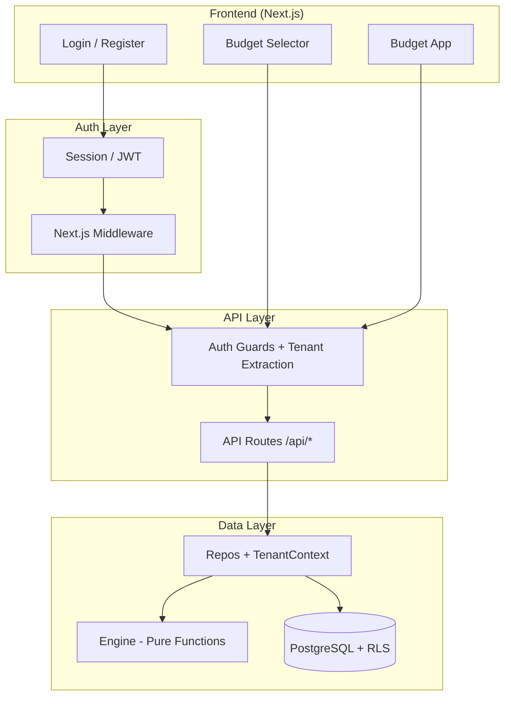
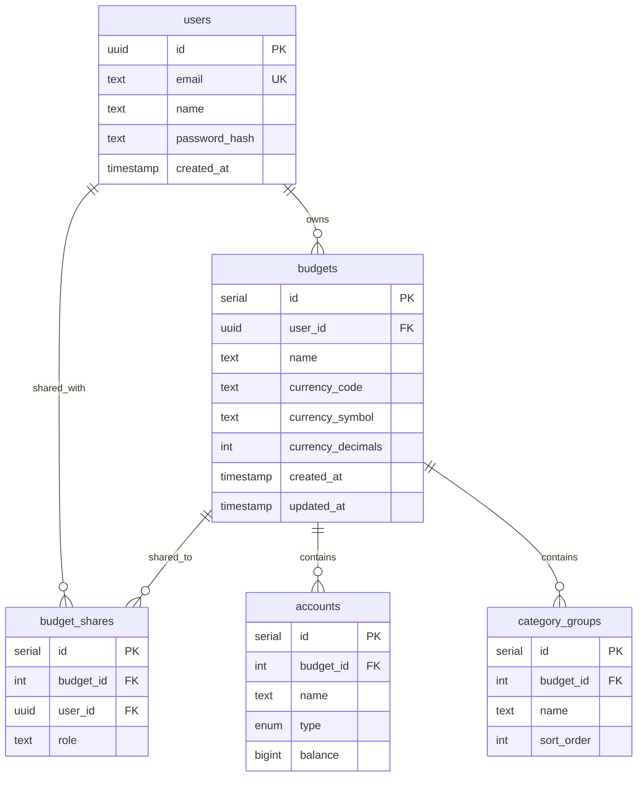

# SaaS Multi-Tenancy Migration Blueprint

> **Objetivo:** Transformar el YNAB Clone de una app single-tenant personal a una plataforma SaaS multi-tenant siguiendo la arquitectura del YNAB real (Shared DB + Row-Level Scoping, múltiples budgets por usuario).

---

## Inventario Actual del Codebase

Antes de planificar cambios, este es el mapa completo de lo que existe:

| Capa            | Archivos                                                                                                                                                                                                                                                                                                                                                                                                                                                          | LOC Aprox. | Estado Multi-Tenant                                          |
| --------------- | ----------------------------------------------------------------------------------------------------------------------------------------------------------------------------------------------------------------------------------------------------------------------------------------------------------------------------------------------------------------------------------------------------------------------------------------------------------------- | ---------- | ------------------------------------------------------------ |
| **DB Schema**   | [schema.ts](file:///Users/camilopiedra/Documents/YNAB/ynab-app/lib/db/schema.ts)                                                                                                                                                                                                                                                                                                                                                                                  | 208        | ✅ `budgetId` agregado a tablas raíz                         |
| **Repos**       | [accounts.ts](file:///Users/camilopiedra/Documents/YNAB/ynab-app/lib/repos/accounts.ts), [budget.ts](file:///Users/camilopiedra/Documents/YNAB/ynab-app/lib/repos/budget.ts), [transactions.ts](file:///Users/camilopiedra/Documents/YNAB/ynab-app/lib/repos/transactions.ts), [categories.ts](file:///Users/camilopiedra/Documents/YNAB/ynab-app/lib/repos/categories.ts), [budgets.ts](file:///Users/camilopiedra/Documents/YNAB/ynab-app/lib/repos/budgets.ts) | ~1700      | ✅ Todos scoped por `budgetId`                               |
| **Repo Client** | [client.ts](file:///Users/camilopiedra/Documents/YNAB/ynab-app/lib/repos/client.ts), [index.ts](file:///Users/camilopiedra/Documents/YNAB/ynab-app/lib/repos/index.ts)                                                                                                                                                                                                                                                                                            | 172        | ✅ Repos aceptan `budgetId` como parámetro                   |
| **Engine**      | 10 módulos en `lib/engine/`                                                                                                                                                                                                                                                                                                                                                                                                                                       | ~2400      | ✅ **No requiere cambios** (funciones puras)                 |
| **API Routes**  | 12 archivos en `app/api/budgets/[budgetId]/`                                                                                                                                                                                                                                                                                                                                                                                                                      | ~620       | ✅ RESTful nested + auth guards                              |
| **Zod Schemas** | 5 archivos en `lib/schemas/`                                                                                                                                                                                                                                                                                                                                                                                                                                      | ~190       | ✅ Todos incluyen `budgetId`                                 |
| **DTOs**        | 5 archivos en `lib/dtos/`                                                                                                                                                                                                                                                                                                                                                                                                                                         | ~550       | ✅ Incluyen `budgetId`                                       |
| **Hooks**       | 11 archivos en `hooks/`                                                                                                                                                                                                                                                                                                                                                                                                                                           | ~1100      | ✅ Todos pasan `budgetId`, URLs nested                       |
| **Components**  | 19 archivos en `components/`                                                                                                                                                                                                                                                                                                                                                                                                                                      | ~5000      | ✅ `budgetId` via URL params                                 |
| **Scripts**     | 7 archivos en `scripts/`                                                                                                                                                                                                                                                                                                                                                                                                                                          | ~650       | ✅ Migración multitenancy ejecutada                          |
| **Unit Tests**  | 17 archivos en `lib/__tests__/`                                                                                                                                                                                                                                                                                                                                                                                                                                   | ~4500      | ✅ Actualizados (370/370 passing) + tenant-isolation         |
| **E2E Tests**   | 10 archivos en `tests/`                                                                                                                                                                                                                                                                                                                                                                                                                                           | ~2000      | ✅ 42/42 passing — auth, budget-selection, tenant-isolation  |
| **Persistence** | `lib/persistence/` (IDB)                                                                                                                                                                                                                                                                                                                                                                                                                                          | ~100       | ✅ Cache version bumped (v2), query keys incluyen `budgetId` |
| **Data Import** | `lib/data-import/index.ts`                                                                                                                                                                                                                                                                                                                                                                                                                                        | 514        | ❌ Lectura de CSV local                                      |
| **Migrations**  | 2 archivos SQL en `drizzle/`                                                                                                                                                                                                                                                                                                                                                                                                                                      | 81         | ✅ Tablas de tenancy agregadas                               |

---

## Arquitectura Meta (YNAB Real)



### Modelo de Datos Target



> [!IMPORTANT]
> El **tenant boundary** es el `budget`, NO el `user`. Un user puede tener múltiples budgets y un budget puede ser compartido con múltiples users (como el YNAB real). Esto es crítico para toda la arquitectura.

---

## Fases de Migración

Las fases están diseñadas para ser ejecutadas en orden. Cada sub-tarea es atómica y verificable.

---

### Fase 0: Preparación del Entorno

> Configuraciones previas necesarias antes de tocar código.

- [x] **0.1** Crear branch `feature/multi-tenancy`
- [x] **0.2** Verificar que todos los tests pasan en el estado actual (`npm run test` + `npm run test:e2e`)
- [x] **0.3** Hacer snapshot/backup de la DB actual: `pg_dump ynab_dev > backup_pre_multitenancy.sql`

---

### Fase 1: Autenticación (Auth Foundation) ✅

> Sin autenticación no hay multi-tenancy. Esta fase agrega el concepto de "quién eres".
>
> **Completada:** 2026-02-09. Desviaciones del plan original documentadas con ⚡.

#### 1.1 — Instalar y Configurar NextAuth.js

- [x] **1.1.1** Instalar dependencias: `next-auth@beta`, `@auth/drizzle-adapter`, `bcryptjs`, `@types/bcryptjs`
- [x] **1.1.2** Agregar variables de entorno a `.env` y `lib/env.ts`
  - ⚡ Auth.js v5 usa `AUTH_SECRET` (no `NEXTAUTH_SECRET`) y `AUTH_URL` es opcional (auto-detectada)
- [x] **1.1.3** Agregar validación Zod en [env.ts](file:///Users/camilopiedra/Documents/YNAB/ynab-app/lib/env.ts)

#### 1.2 — Schema de Usuarios (DB)

- [x] **1.2.1** Agregar tabla `users` al schema en [schema.ts](file:///Users/camilopiedra/Documents/YNAB/ynab-app/lib/db/schema.ts)
  - ⚡ Solo tabla `users` (uuid PK, email unique, password bcrypt hash, name, created_at). No se necesitan `sessions`, `verification_tokens`, ni `authenticators` porque usamos JWT + Credentials Provider (sin OAuth).
- [x] **1.2.2** Generar la migración: `drizzle/0002_romantic_inertia.sql`
- [x] **1.2.3** Aplicar migración: `npm run db:migrate`

#### 1.3 — Auth Config y API Route

- [x] **1.3.1** Crear [auth.ts](file:///Users/camilopiedra/Documents/YNAB/ynab-app/lib/auth.ts) — Auth.js v5 config:
  - Provider: `CredentialsProvider` (email + password)
  - Session strategy: `jwt` con `trustHost: true`
  - Callbacks: `userId` propagado al JWT y session
  - ⚡ Sin Drizzle Adapter (no se usa con Credentials+JWT). DB queries directos con Drizzle ORM.
- [x] **1.3.2** Crear [route.ts](file:///Users/camilopiedra/Documents/YNAB/ynab-app/app/api/auth/%5B...nextauth%5D/route.ts) — Auth.js catch-all handler
- [x] **1.3.3** Crear [register/route.ts](file:///Users/camilopiedra/Documents/YNAB/ynab-app/app/api/auth/register/route.ts) — registro con bcrypt cost 12 + Zod validation ([auth.ts](file:///Users/camilopiedra/Documents/YNAB/ynab-app/lib/schemas/auth.ts))

#### 1.4 — Proxy de Protección

- [x] **1.4.1** Crear [proxy.ts](file:///Users/camilopiedra/Documents/YNAB/ynab-app/proxy.ts) en la raíz del proyecto:
  - ⚡ Next.js 16.1.6 renombró `middleware.ts` → `proxy.ts`. Función exportada como `proxy` (no `middleware`).
  - Llama `auth()` para verificar JWT, redirige a `/auth/login` con `new URL('/auth/login', request.url)` (port-agnostic).
  - Matcher: `/((?!auth|api/auth|_next|favicon).*)`

#### 1.5 — Páginas de Auth (Frontend)

- [x] **1.5.1** Crear [login/page.tsx](file:///Users/camilopiedra/Documents/YNAB/ynab-app/app/auth/login/page.tsx) — formulario neumórfico
- [x] **1.5.2** Crear [register/page.tsx](file:///Users/camilopiedra/Documents/YNAB/ynab-app/app/auth/register/page.tsx) — registro con auto-login
- [x] **1.5.3** Estilizado con design system neumórfico existente (Inter, dark mode, neu-card, neu-inset)
- [x] **1.5.4** Logout funcional en [Sidebar.tsx](file:///Users/camilopiedra/Documents/YNAB/ynab-app/components/Sidebar.tsx) + user avatar dinámico
- [x] **1.5.5** ⚡ **Layout restructuring**: Route groups `app/(app)/` para rutas con sidebar, `app/auth/` sin sidebar. [ClientShell.tsx](file:///Users/camilopiedra/Documents/YNAB/ynab-app/components/ClientShell.tsx) simplificado.

#### 1.6 — Auth Context en React

- [x] **1.6.1** `SessionProvider` agregado en [Providers.tsx](file:///Users/camilopiedra/Documents/YNAB/ynab-app/components/Providers.tsx) (envuelve todo el provider tree)
- [x] **1.6.2** Hook [useAuth.ts](file:///Users/camilopiedra/Documents/YNAB/ynab-app/hooks/useAuth.ts) → `userId`, `email`, `name`, `isLoading`, `isAuthenticated`

#### Verificación Fase 1

- [x] **V1.1** Navegar a `/budget` sin login → redirige a `/auth/login` ✅
- [x] **V1.2** Registrar usuario → auto-login → accede a `/budget` ✅
- [x] **V1.3** Cerrar sesión (Sidebar) → redirige a `/auth/login` ✅
- [ ] **V1.4** Llamar API directamente sin session → 401 Unauthorized — **Pendiente Fase 3** (protección de API routes)
- [x] **V1.5** Tests unitarios: **360/360 pasando** ✅
- [x] **V1.6** E2E: **27/27 pasando** ✅ — [auth.setup.ts](file:///Users/camilopiedra/Documents/YNAB/ynab-app/tests/auth.setup.ts) con login fixture + test user en [global-setup.ts](file:///Users/camilopiedra/Documents/YNAB/ynab-app/tests/global-setup.ts)

---

### Fase 2: Modelo de Tenant (Budget Multi-Tenancy) ✅

> **Completada:** 2026-02-09. Todas las sub-tareas implementadas y verificadas.

> Agregar el concepto de "budget" como unidad de aislamiento de datos.

#### 2.1 — Tablas Nuevas en Schema

- [x] **2.1.1** Agregar tabla `budgets` en [schema.ts](file:///Users/camilopiedra/Documents/YNAB/ynab-app/lib/db/schema.ts) ✅
- [x] **2.1.2** Agregar tabla `budget_shares` ✅

#### 2.2 — Agregar `budget_id` a Tablas Existentes

> Solo las tablas "raíz" necesitan `budget_id`. Las hijas heredan tenancy vía FK chain.

- [x] **2.2.1** Agregar `budgetId` a `accounts` ✅
- [x] **2.2.2** Agregar `budgetId` a `category_groups` ✅

- [x] **2.2.3** Agregar índices compuestos para performance ✅
- [x] **2.2.4** Actualizar `relations()` en [schema.ts](file:///Users/camilopiedra/Documents/YNAB/ynab-app/lib/db/schema.ts) para incluir budgets ✅

#### 2.3 — Migración de Datos Existentes

- [x] **2.3.1** Crear script `scripts/migrate-to-multitenancy.ts` ✅
- [x] **2.3.2** Generar migración Drizzle ✅
- [x] **2.3.3** Aplicar migración ✅
- [x] **2.3.4** Ejecutar script de backfill ✅ (Datos migrados a un budget default para el usuario legacy)

#### 2.4 — Budget Selection Page

- [x] **2.4.1** Crear [page.tsx](file:///Users/camilopiedra/Documents/YNAB/ynab-app/app/budgets/page.tsx) — lista de budgets del user ✅
- [x] **2.4.2** Crear [new/page.tsx](file:///Users/camilopiedra/Documents/YNAB/ynab-app/app/budgets/new/page.tsx) — crear nuevo budget (nombre, moneda) ✅
- [x] **2.4.3** Agregar API endpoints: ✅
  - [route.ts](file:///Users/camilopiedra/Documents/YNAB/ynab-app/app/api/budgets/route.ts) — GET (list), POST (create)
  - [route.ts](file:///Users/camilopiedra/Documents/YNAB/ynab-app/app/api/budgets/%5Bid%5D/route.ts) — GET (detail), PATCH (update), DELETE

- [x] **2.4.4** Modificar routing: `/budget` → `/budgets/[budgetId]/budget` ✅
  - Estructura: `app/(app)/budgets/[budgetId]/{budget,accounts,dashboard,reports}`
- [x] **2.4.5** Crear hook [useBudgets.ts](file:///Users/camilopiedra/Documents/YNAB/ynab-app/hooks/useBudgets.ts) ✅ (`useBudgets`, `useBudget`, `useBudgetMutations`)
- [x] **2.4.6** Agregar budget selector en [Sidebar.tsx](file:///Users/camilopiedra/Documents/YNAB/ynab-app/components/Sidebar.tsx) ✅ (dropdown neumórfico con switch, create, manage)

#### Verificación Fase 2

- [x] **V2.1** Datos existentes migrados correctamente (todas las cuentas/categorías tienen budget_id) ✅
- [x] **V2.2** `SELECT * FROM budgets` muestra 1 budget ("Mi Presupuesto") con el user legacy ✅
- [x] **V2.3** Página de budgets muestra el budget migrado ✅
- [x] **V2.4** Crear nuevo budget → aparece en la lista ✅
- [x] **V2.5** Tests unitarios existentes siguen pasando: **360/360** ✅
- [x] **V2.6** No hay registros con `budget_id = NULL` en accounts o category_groups ✅

---

### Fase 3: Tenant Context y Query Scoping ✅

> **Completada:** 2026-02-09. Todas las sub-tareas implementadas y verificadas.
>
> El corazón de la migración: cada query debe estar scoped al budget activo.

#### 3.1 — Crear TenantContext ✅

- [x] **3.1.1** Crear `lib/tenant-context.ts` ✅
- [x] **3.1.2** Crear `lib/auth-helpers.ts` con `requireAuth()`, `requireBudgetAccess()`, `extractBudgetId()` ✅

> **Nota:** La implementación final usa un patrón discriminated union (`{ ok: true, tenant }` / `{ ok: false, response }`) en lugar de excepciones, más idiomático en Next.js App Router.

#### 3.2 — Factory de Repos (NO NECESARIO) ✅

> **Todos los repos ya aceptan `budgetId` como parámetro.** No se requieren cambios en la factory. El scoping se valida en la capa de API routes con `requireBudgetAccess()` antes de llamar a las funciones de repo.

#### 3.3 — Scoped Queries en Accounts Repo ✅

> Las 10 funciones ya aceptan `budgetId` como parámetro y filtran por él.

- [x] **3.3.1-3.3.10** Todas las funciones ya están scoped por budgetId ✅

#### 3.4 — Scoped Queries en Categories Repo ✅

> Las 8 funciones ya aceptan `budgetId` como parámetro y filtran por él.

- [x] **3.4.1-3.4.8** Todas las funciones ya están scoped por budgetId ✅

#### 3.5 — Scoped Queries en Transactions Repo

> **Archivo:** [transactions.ts](file:///Users/camilopiedra/Documents/YNAB/ynab-app/lib/repos/transactions.ts) — 15 funciones, muchas heredan scope vía accountId

- [x] **3.5.1** `getTransactions()` → Scoped por budgetId ✅
- [x] **3.5.2** `getTransaction()` → Scoped por budgetId ✅
- [x] **3.5.3** `createTransaction()` → Scoped por budgetId ✅
- [x] **3.5.4** `updateTransaction()` → Scoped por budgetId ✅
- [x] **3.5.5** `deleteTransaction()` → Scoped por budgetId ✅
- [x] **3.5.6** `toggleTransactionCleared()` → Scoped por budgetId ✅
- [x] **3.5.7** `getTransferByTransactionId()` → Scoped por budgetId ✅
- [x] **3.5.8** `createTransfer()` → Scoped por budgetId ✅
- [x] **3.5.9** `deleteTransfer()` → Scoped por budgetId ✅
- [x] **3.5.10** `createTransactionAtomic()` → Scoped por budgetId ✅
- [x] **3.5.11** `updateTransactionAtomic()` → Scoped por budgetId ✅
- [x] **3.5.12** `deleteTransactionAtomic()` → Scoped por budgetId ✅
- [x] **3.5.13** `toggleClearedAtomic()` → Scoped por budgetId ✅
- [x] **3.5.14** `reconcileAccountAtomic()` → Scoped por budgetId ✅

#### 3.6 — Scoped Queries en Budget Repo ✅

> **Archivo:** [budget.ts](file:///Users/camilopiedra/Documents/YNAB/ynab-app/lib/repos/budget.ts) — 880 LOC, 18 funciones, ~30+ raw SQL queries
>
> **Verificado:** Todas las 30+ raw SQL queries ya tienen `budgetId` scoping (`eq(categoryGroups.budgetId, budgetId)` o `cg.budget_id = ${budgetId}`).

- [x] **3.6.1** `computeCarryforward()` — scoped por `budgetId` via category_groups join ✅
- [x] **3.6.2** `getBudgetForMonth()` — `cg.budget_id = ${budgetId}` ✅
- [x] **3.6.3** `getReadyToAssign()` — 6 queries internas, todas con budget scope ✅
- [x] **3.6.4** `getReadyToAssignBreakdown()` — 4 queries, todas con budget scope ✅
- [x] **3.6.5** `updateBudgetAssignment()` — scoped upstream por categoryId ✅
- [x] **3.6.6** `updateBudgetActivity()` — `accounts.budgetId = ${budgetId}` ✅
- [x] **3.6.7** `refreshAllBudgetActivity()` — scoped por budgetId ✅
- [x] **3.6.8** `getCreditCardPaymentCategory()` — scoped por accountId (upstream) ✅
- [x] **3.6.9** `ensureCreditCardPaymentCategory()` — `categoryGroups.budgetId = budgetId` ✅
- [x] **3.6.10** `updateCreditCardPaymentBudget()` — 3 queries, todas con budget scope ✅
- [x] **3.6.11** `getCashOverspendingForMonth()` — budget scope en categories query ✅
- [x] **3.6.12** `getOverspendingTypes()` — budget scope ✅
- [x] **3.6.13** `getBudgetInspectorData()` — 10+ queries, todas con budget scope ✅

#### 3.7 — API Routes: Auth Guards + Tenant Extraction ✅

> Cada API route usa `requireBudgetAccess()` o `requireAuth()` antes de procesar. `budgetId` se extrae del URL path (`/api/budgets/[budgetId]/...`).

- [x] **3.7.1** [accounts/route.ts](file:///Users/camilopiedra/Documents/YNAB/ynab-app/app/api/budgets/%5BbudgetId%5D/accounts/route.ts) — GET, POST ✅
- [x] **3.7.2** [accounts/[id]/route.ts](file:///Users/camilopiedra/Documents/YNAB/ynab-app/app/api/budgets/%5BbudgetId%5D/accounts/%5Bid%5D/route.ts) — GET, PATCH ✅
- [x] **3.7.3** [budget/route.ts](file:///Users/camilopiedra/Documents/YNAB/ynab-app/app/api/budgets/%5BbudgetId%5D/budget/route.ts) — GET, POST ✅
- [x] **3.7.4** [categories/route.ts](file:///Users/camilopiedra/Documents/YNAB/ynab-app/app/api/budgets/%5BbudgetId%5D/categories/route.ts) — GET, POST, PATCH ✅
- [x] **3.7.5** [categories/reorder/route.ts](file:///Users/camilopiedra/Documents/YNAB/ynab-app/app/api/budgets/%5BbudgetId%5D/categories/reorder/route.ts) — POST ✅
- [x] **3.7.6** [category-groups/route.ts](file:///Users/camilopiedra/Documents/YNAB/ynab-app/app/api/budgets/%5BbudgetId%5D/category-groups/route.ts) — POST ✅
- [x] **3.7.7** [transactions/route.ts](file:///Users/camilopiedra/Documents/YNAB/ynab-app/app/api/budgets/%5BbudgetId%5D/transactions/route.ts) — GET, POST, PUT, DELETE, PATCH ✅
- [x] **3.7.8** [payees/route.ts](file:///Users/camilopiedra/Documents/YNAB/ynab-app/app/api/budgets/%5BbudgetId%5D/payees/route.ts) — GET ✅
- [x] **3.7.9** [budgets/route.ts](file:///Users/camilopiedra/Documents/YNAB/ynab-app/app/api/budgets/route.ts) — uses `requireAuth()` ✅
- [x] **3.7.10** [budgets/[budgetId]/route.ts](file:///Users/camilopiedra/Documents/YNAB/ynab-app/app/api/budgets/%5BbudgetId%5D/route.ts) — uses `requireBudgetAccess()` ✅

**Patrón estándar para cada route (implementado):**

```typescript
import { requireBudgetAccess } from "@/lib/auth-helpers";

type RouteContext = { params: Promise<{ budgetId: string }> };

export async function GET(request: Request, context: RouteContext) {
  const { budgetId } = await context.params;
  const auth = await requireBudgetAccess(request, parseInt(budgetId));
  if (!auth.ok) return auth.response;

  // ... usar auth.tenant.budgetId en las funciones de repo
}
```

#### 3.8 — Zod Schemas: Agregar `budgetId` donde sea necesario ✅

- [x] **3.8.1** [budget.ts](file:///Users/camilopiedra/Documents/YNAB/ynab-app/lib/schemas/budget.ts) — `BudgetAssignmentSchema` ya tiene `budgetId` ✅
- [x] **3.8.2** [transactions.ts](file:///Users/camilopiedra/Documents/YNAB/ynab-app/lib/schemas/transactions.ts) — Scoped por budgetId ✅
- [x] **3.8.3** [accounts.ts](file:///Users/camilopiedra/Documents/YNAB/ynab-app/lib/schemas/accounts.ts) — Ya tiene budgetId en Create/Update ✅
- [x] **3.8.4** [categories.ts](file:///Users/camilopiedra/Documents/YNAB/ynab-app/lib/schemas/categories.ts) — Agregado `budgetId` a `UpdateCategoryNameSchema` ✅

> [!TIP]
> El `budgetId` NO debe venir del body del request (inseguro — el user podría falsificarlo). Debe venir de la URL path (`/api/budgets/[budgetId]/...`) o del header/cookie de sesión.

#### 3.9 — Frontend: Pasar `budgetId` en requests

- [x] **3.9.1** Pasar `budgetId` en todos los hooks de transacciones ✅
  - [useTransactionMutations.ts](file:///Users/camilopiedra/Documents/YNAB/ynab-app/hooks/useTransactionMutations.ts) ✅

- [x] **3.9.2** `budgetId` viene del URL param (`[budgetId]`) via `useParams()` — no se necesita `BudgetProvider` ✅

- [x] **3.9.3** React Query keys ya incluyen `budgetId` en todos los hooks ✅

- [x] **3.9.4** No se necesita `BudgetProvider` — el pattern de URL params es suficiente ✅

- [x] **3.9.5** Cache version bumped a `2` en `lib/persistence/persister.ts` — invalida cache viejo ✅

#### 3.10 — Reestructurar API Routes (URL Nesting) ✅

> Migrado de `/api/accounts` a `/api/budgets/[budgetId]/accounts` para un diseño RESTful correcto.

- [x] **3.10.1** Crear nueva estructura de directorios: ✅

  ```
  app/api/budgets/route.ts                           (list/create budgets)
  app/api/budgets/[budgetId]/route.ts                 (get/update/delete budget)
  app/api/budgets/[budgetId]/accounts/route.ts        (accounts CRUD)
  app/api/budgets/[budgetId]/accounts/[id]/route.ts   (account detail)
  app/api/budgets/[budgetId]/budget/route.ts           (budget data + RTA)
  app/api/budgets/[budgetId]/transactions/route.ts     (transactions CRUD)
  app/api/budgets/[budgetId]/categories/route.ts       (categories CRUD)
  app/api/budgets/[budgetId]/categories/reorder/route.ts
  app/api/budgets/[budgetId]/category-groups/route.ts
  app/api/budgets/[budgetId]/payees/route.ts
  ```

- [x] **3.10.2** Mover lógica de los routes actuales a la nueva estructura ✅
- [x] **3.10.3** Eliminar los routes viejos en `app/api/` (accounts, budget, categories, category-groups, payees, transactions) ✅
- [x] **3.10.4** Actualizar 7 hooks frontend para usar nuevas URLs nested ✅
- [x] **3.10.5** Refactorizar [dashboard/page.tsx](<file:///Users/camilopiedra/Documents/YNAB/ynab-app/app/(app)/budgets/[budgetId]/dashboard/page.tsx>) — reemplazó `fetch` + `useState` + `useEffect` con `useAccounts()` y `useTransactions()` hooks (cache compartido, optimistic updates, sin interfaces locales duplicadas) ✅

#### Verificación Fase 3

- [x] **V3.1** TypeScript check: 0 errores ✅
- [x] **V3.2** Unit tests: 360/360 pasan ✅
- [x] **V3.3** User A solo ve datos de sus budgets; User B ve los suyos ✅
- [x] **V3.4** Intentar acceder a un budget de otro user → 403 Forbidden ✅
- [x] **V3.5** Crear transacción en budget A → NO aparece en budget B ✅
- [x] **V3.6** RTA calcula correctamente por budget (no mezcla datos entre budgets) ✅
- [x] **V3.7** E2E tests actualizados y pasan ✅
- [x] **V3.8** Test de aislamiento: crear 2 users con 2 budgets → verificar cero data leaks ✅

---

### Fase 4: Test Infrastructure Update

> Los tests actuales asumen single-tenant. Hay que actualizarlos para el nuevo modelo.

#### 4.1 — Test Helpers

- [x] **4.1.1** Modificar [test-helpers.ts](file:///Users/camilopiedra/Documents/YNAB/ynab-app/lib/__tests__/test-helpers.ts) ✅
  - `createTestDb()` crea `users`, `budgets`, `budget_shares` auto-máticamente.
  - `seedBasicBudget()` acepta `budgetId` y `db` context.

#### 4.2 — Unit Tests

- [x] **4.2.1** Actualizar [db-core.test.ts](file:///Users/camilopiedra/Documents/YNAB/ynab-app/lib/__tests__/db-core.test.ts) ✅
- [x] **4.2.2** Actualizar [accounts.test.ts](file:///Users/camilopiedra/Documents/YNAB/ynab-app/lib/__tests__/accounts.test.ts) ✅
- [x] **4.2.3** Actualizar [categories.test.ts](file:///Users/camilopiedra/Documents/YNAB/ynab-app/lib/__tests__/categories.test.ts) ✅
- [x] **4.2.4** Actualizar [transactions.test.ts](file:///Users/camilopiedra/Documents/YNAB/ynab-app/lib/__tests__/transactions.test.ts) ✅
- [x] **4.2.5** Actualizar [rta.test.ts](file:///Users/camilopiedra/Documents/YNAB/ynab-app/lib/__tests__/rta.test.ts) ✅
- [x] **4.2.6** Actualizar [budget-assignment.test.ts](file:///Users/camilopiedra/Documents/YNAB/ynab-app/lib/__tests__/budget-assignment.test.ts) ✅
- [x] **4.2.7** Actualizar [budget-edge-cases.test.ts](file:///Users/camilopiedra/Documents/YNAB/ynab-app/lib/__tests__/budget-edge-cases.test.ts) ✅
- [x] **4.2.8** Actualizar [budget-extended.test.ts](file:///Users/camilopiedra/Documents/YNAB/ynab-app/lib/__tests__/budget-extended.test.ts) ✅
- [x] **4.2.9** Actualizar [cc-payment.test.ts](file:///Users/camilopiedra/Documents/YNAB/ynab-app/lib/__tests__/cc-payment.test.ts) ✅
- [x] **4.2.10** Actualizar [overspending.test.ts](file:///Users/camilopiedra/Documents/YNAB/ynab-app/lib/__tests__/overspending.test.ts) ✅
- [x] **4.2.11** Actualizar [carryforward.test.ts](file:///Users/camilopiedra/Documents/YNAB/ynab-app/lib/__tests__/carryforward.test.ts) ✅
- [x] **4.2.12** Actualizar [dtos.test.ts](file:///Users/camilopiedra/Documents/YNAB/ynab-app/lib/__tests__/dtos.test.ts) ✅
- [x] **4.2.13** Actualizar [schemas.test.ts](file:///Users/camilopiedra/Documents/YNAB/ynab-app/lib/__tests__/schemas.test.ts) ✅
- [x] **4.2.14** SIN CAMBIOS: [engine.test.ts](file:///Users/camilopiedra/Documents/YNAB/ynab-app/lib/__tests__/engine.test.ts), [engine-extended.test.ts](file:///Users/camilopiedra/Documents/YNAB/ynab-app/lib/__tests__/engine-extended.test.ts) (engine es puro, no toca DB) ✅

#### 4.3 — Nuevos Tests de Aislamiento

- [x] **4.3.1** Crear [tenant-isolation.test.ts](file:///Users/camilopiedra/Documents/YNAB/ynab-app/lib/__tests__/tenant-isolation.test.ts) ✅
  - 10 tests: accounts, categories, transactions, payees, budget data, RTA isolation
  - 2 budgets con datos independientes en la misma DB PGlite
  - Verifica zero data leaks entre budgets

#### 4.4 — E2E Tests

- [x] **4.4.1** Actualizar [global-setup.ts](file:///Users/camilopiedra/Documents/YNAB/ynab-app/tests/global-setup.ts) — crear user + login antes de tests ✅
- [x] **4.4.2** Actualizar todos los E2E specs para incluir login step (via [auth.setup.ts](file:///Users/camilopiedra/Documents/YNAB/ynab-app/tests/auth.setup.ts) + storageState) ✅
- [x] **4.4.3** Crear [auth.spec.ts](file:///Users/camilopiedra/Documents/YNAB/ynab-app/tests/auth.spec.ts) — login, register, logout, invalid login, protected routes ✅
- [x] **4.4.4** Crear [budget-selection.spec.ts](file:///Users/camilopiedra/Documents/YNAB/ynab-app/tests/budget-selection.spec.ts) — listar, crear, seleccionar budgets ✅

#### Verificación Fase 4

- [x] **V4.1** `npm run test` → 370/370 unit tests passing ✅
- [x] **V4.2** `npm run test:e2e` → 42/42 E2E tests passing ✅
- [x] **V4.3** `npm run lint` → 0 errores ✅
- [x] **V4.4** `npm run build` → build exitoso ✅

---

### Fase 5: Data Import Multi-Tenant ✅

> **Completada:** 2026-02-09. Import refactorizado para multi-tenant con upload desde browser.

> El import actual lee CSVs del filesystem. Necesita ser per-budget.

- [x] **5.1** Modificar [data-import/index.ts](file:///Users/camilopiedra/Documents/YNAB/ynab-app/lib/data-import/index.ts): ✅
  - Extraído `importDataFromCSV(budgetId, registerCSV, planCSV, targetDb)` — sin dependencia de filesystem
  - `importData()` mantenido como wrapper CLI (lazy-loads `fs`, lee archivos, delega)
  - Nuevo tipo `ImportStats` con conteos de entidades importadas

- [x] **5.2** Crear endpoint de upload: [import/route.ts](file:///Users/camilopiedra/Documents/YNAB/ynab-app/app/api/budgets/%5BbudgetId%5D/import/route.ts) ✅
  - POST con `multipart/form-data` (archivos `register` + `plan`)
  - Auth guard via `requireBudgetAccess()`
  - Límite de 10MB por archivo
  - Retorna `{ success, stats }`

- [x] **5.3** Crear UI de import en [ImportModal.tsx](file:///Users/camilopiedra/Documents/YNAB/ynab-app/components/ImportModal.tsx) ✅
  - Drop zones neumórficas para Register y Plan CSV
  - Estados: idle → uploading → success (con grid de stats) → error
  - Invalidación automática de cache en éxito

- [x] **5.4** Actualizar [import-ynab-data.ts](file:///Users/camilopiedra/Documents/YNAB/ynab-app/scripts/import-ynab-data.ts) para CLI usage con `--budget-id` ✅

- [x] **5.5** Trigger de import en [Sidebar.tsx](file:///Users/camilopiedra/Documents/YNAB/ynab-app/components/Sidebar.tsx) ✅
  - Botón "Importar Datos" en dropdown de budget

#### Verificación Fase 5

- [x] **V5.1** TypeScript: 0 errores ✅
- [x] **V5.2** Lint: 0 errores ✅
- [x] **V5.3** Unit tests: 370/370 passing ✅
- [x] **V5.4** Build: exitoso ✅

---

### Fase 6: Seguridad y Hardening ✅

> **Completada:** 2026-02-09. Todas las medidas de seguridad implementadas y verificadas.
>
> Medidas de protección que YNAB real implementa.

- [x] **6.1** Row-Level Security (RLS) en PostgreSQL como safety net: ✅
  - [0006_security_rls.sql](file:///Users/camilopiedra/Documents/YNAB/ynab-app/drizzle/0006_security_rls.sql) — policies para `accounts`, `category_groups`, `budgets`
  - `setTenantContext()` en [auth-helpers.ts](file:///Users/camilopiedra/Documents/YNAB/ynab-app/lib/auth-helpers.ts) — auto-llamado desde `requireBudgetAccess()`
  - ⚡ RLS solo aplica con rol non-superuser. En dev local (superuser) las policies existen pero no restringen.

- [x] **6.2** Rate limiting en API routes: ✅
  - [rate-limit.ts](file:///Users/camilopiedra/Documents/YNAB/ynab-app/lib/rate-limit.ts) — sliding window in-memory con presets: AUTH (5/min), API (60/min), IMPORT (3/5min)
  - Aplicado a: login (`[...nextauth]/route.ts`), register (`register/route.ts`), import (`import/route.ts`)
  - ⚡ In-memory only — se resetea con restart del server. Para multi-instancia, migrar a Redis.

- [x] **6.3** Input sanitization review: ✅
  - `.trim()` agregado a todos los campos de texto user-facing en 5 Zod schemas (auth, accounts, categories, budget, transactions)
  - SQL injection: verificado — todos los raw SQL usan `sql` template literals (parameterized). Drizzle ORM también parametriza.

- [x] **6.4** CORS configuration para producción: ✅
  - [next.config.ts](file:///Users/camilopiedra/Documents/YNAB/ynab-app/next.config.ts) — `CORS_ORIGIN` env var para producción. Sin CORS en dev (same-origin).

- [x] **6.5** Security headers (CSP, HSTS, etc.) en `next.config.ts`: ✅
  - X-Content-Type-Options: nosniff
  - X-Frame-Options: DENY
  - X-XSS-Protection: 1; mode=block
  - Referrer-Policy: strict-origin-when-cross-origin
  - Permissions-Policy: camera=(), microphone=(), geolocation=()
  - Strict-Transport-Security: max-age=63072000 (2 años)
  - Content-Security-Policy: default-src 'self' + allowances para Next.js

- [x] **6.6** Password hashing con bcrypt (cost factor ≥ 12): ✅
  - Verificado en `register/route.ts` línea 42: `bcrypt.hash(password, 12)`. Ya implementado desde Fase 1.

- [x] **6.7** Account lockout después de N intentos fallidos: ✅
  - [0005_demonic_anita_blake.sql](file:///Users/camilopiedra/Documents/YNAB/ynab-app/drizzle/0005_demonic_anita_blake.sql) — columns `failed_login_attempts` + `locked_until`
  - [auth.ts](file:///Users/camilopiedra/Documents/YNAB/ynab-app/lib/auth.ts) — 5 intentos → lockout 15 min, reset en login exitoso

#### Verificación Fase 6

- [x] **V6.1** TypeScript: 0 errores ✅
- [x] **V6.2** Lint: 0 errores ✅
- [x] **V6.3** Unit tests: 385/385 passing ✅
- [x] **V6.4** Build: exitoso ✅

---

### Fase 7: SaaS Polish (Post-MVP)

> Features adicionales para ser un SaaS completo como YNAB.

- [ ] **7.1** Multi-Currency Support:
  - `budgets.currency_code`, `currency_symbol`, `currency_decimals`
  - Formateo dinámico en [format.ts](file:///Users/camilopiedra/Documents/YNAB/ynab-app/lib/format.ts) basado en budget currency
  - UI: mostrar símbolo correcto por budget

- [ ] **7.2** Budget Sharing:
  - Usar tabla `budget_shares` creada en Fase 2
  - UI para invitar users por email
  - Permisos: `editor` (full access) vs `viewer` (read-only)

- [ ] **7.3** Subscription/Billing (Stripe):
  - Tabla `subscriptions` (plan, status, stripe_customer_id)
  - Middleware para verificar suscripción activa
  - Página de pricing y checkout

- [ ] **7.4** Connection Pooling:
  - Migrar de `postgres` driver directo a pgBouncer o Supabase pooler
  - Configurar pool limits por # de users concurrentes

- [ ] **7.5** Email Service:
  - Verificación de email al registrarse
  - Password reset flow
  - Budget share invitations
  - Usar Resend, SendGrid, o Amazon SES

- [ ] **7.6** GDPR/Data Deletion:
  - Endpoint `DELETE /api/users/me` que cascade-deletes todo
  - Export data feature (download all user data as JSON/CSV)

- [ ] **7.7** Audit Logging:
  - Tabla `audit_log` (who, what, when, budget_id)
  - Para budget sharing: saber quién cambió qué

---

## Árbol de Decisiones Arquitectónicas

| Decisión              | Opción Elegida              | Alternativas Descartadas            | Razón                                                          |
| --------------------- | --------------------------- | ----------------------------------- | -------------------------------------------------------------- |
| **Auth Provider**     | NextAuth.js v5 (Auth.js)    | Clerk ($), Supabase Auth, Auth0 ($) | Gratis, nativo Next.js, Drizzle adapter, self-hosted           |
| **Session Strategy**  | JWT                         | Database sessions                   | Más escalable, stateless, no requiere query por request        |
| **Tenant Boundary**   | Budget (no user)            | User-level isolation                | YNAB permite múltiples budgets por user + sharing              |
| **DB Strategy**       | Shared DB + query scoping   | Schema-per-tenant, DB-per-tenant    | Datos pequeños por user, migración simple, RLS como safety net |
| **API URL Pattern**   | `/api/budgets/[budgetId]/*` | Header-based, cookie-based          | RESTful, cacheable, debuggable, estándar en SaaS               |
| **Frontend budgetId** | URL path param              | React context only                  | Bookmarkeable, shareable URLs, SSR-friendly                    |
| **Password Hashing**  | bcrypt (cost 12)            | argon2, scrypt                      | Más probado, amplio soporte, suficiente seguridad              |

---

## Estimación de Esfuerzo

| Fase                       | Sub-tareas     | Complejidad | Esfuerzo Est.    |
| -------------------------- | -------------- | ----------- | ---------------- |
| **Fase 0** (Prep)          | 3              | Baja        | 0.5 día          |
| **Fase 1** (Auth)          | 17 + 6 verif.  | Media       | 2–3 días         |
| **Fase 2** (Tenant Model)  | 14 + 6 verif.  | Media       | 2 días           |
| **Fase 3** (Query Scoping) | 60+ sub-tareas | **Alta**    | 5–7 días         |
| **Fase 4** (Tests)         | 20             | Media-Alta  | 2–3 días         |
| **Fase 5** (Import)        | 4              | Media       | 1 día            |
| **Fase 6** (Security)      | 7              | Media       | 1–2 días         |
| **Fase 7** (SaaS Polish)   | 7              | Alta        | 1–2 semanas      |
| **Total MVP (F0–F6)**      |                |             | **~2–3 semanas** |
| **Total Completo (F0–F7)** |                |             | **~4–5 semanas** |

---

## Lo Que NO Cambia

> [!NOTE]
> El motor financiero (`lib/engine/`) — 10 módulos, ~2400 LOC — NO requiere NINGÚN cambio. Todas las funciones son puras (entrada → salida) sin dependencias de DB, HTTP, o contexto de usuario. Esta es la parte más compleja y bug-prone de la app, y está completamente aislada. La arquitectura actual de 3 capas (Engine → Repos → UI) fue la decisión correcta.

---

## Riesgos y Mitigaciones

| Riesgo                                      | Probabilidad | Impacto     | Mitigación                                                     |
| ------------------------------------------- | ------------ | ----------- | -------------------------------------------------------------- |
| Data leak entre tenants                     | Media        | **Crítico** | RLS como safety net + test de aislamiento dedicado             |
| Performance degradada por JOINs adicionales | Baja         | Medio       | Índices compuestos en `budget_id` + explain analyze            |
| Budget repo (830 LOC) difícil de migrar     | Media        | Alto        | Migrar función por función, test por test                      |
| Tests existentes rotos durante migración    | Alta         | Medio       | Mantener backward-compatible hasta finalizar Fase 4            |
| NextAuth v5 en beta                         | Baja         | Medio       | Usar versión estable si disponible, o pin a release específico |
